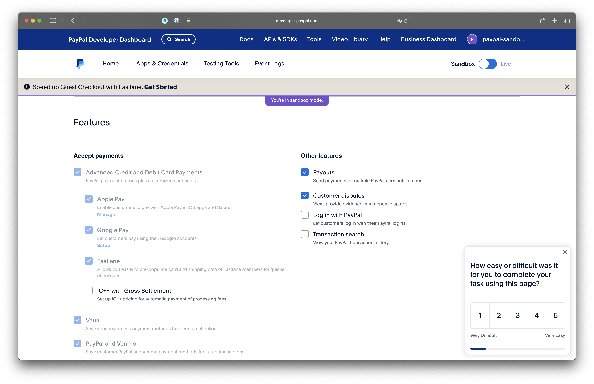
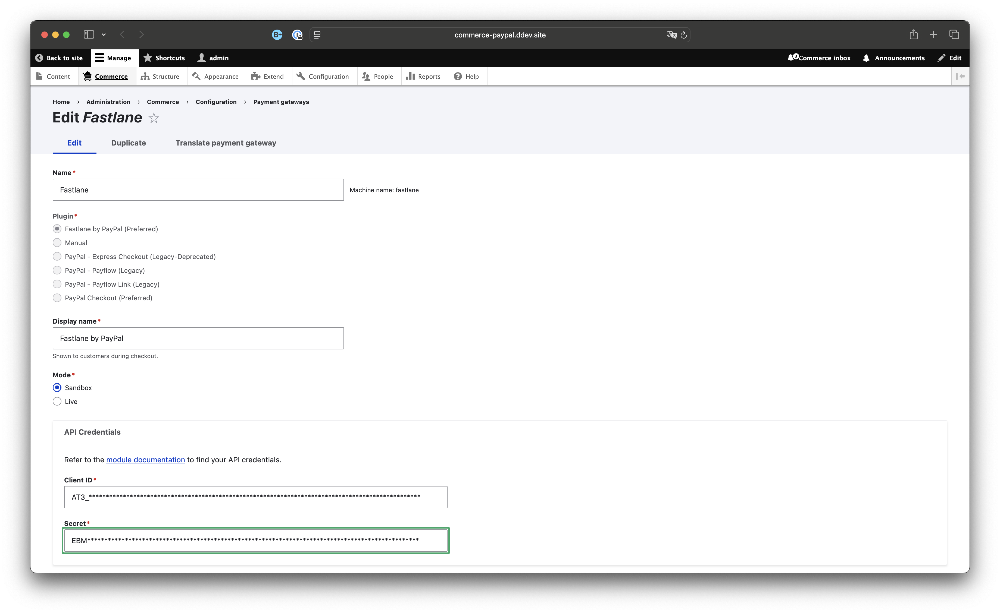
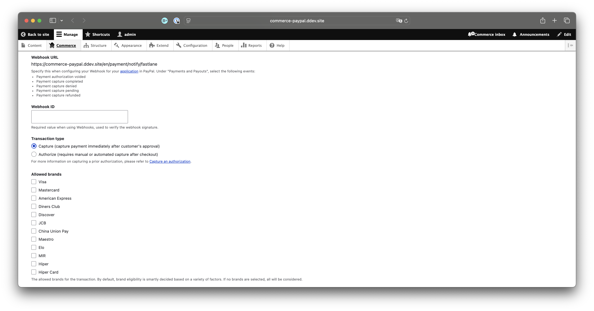
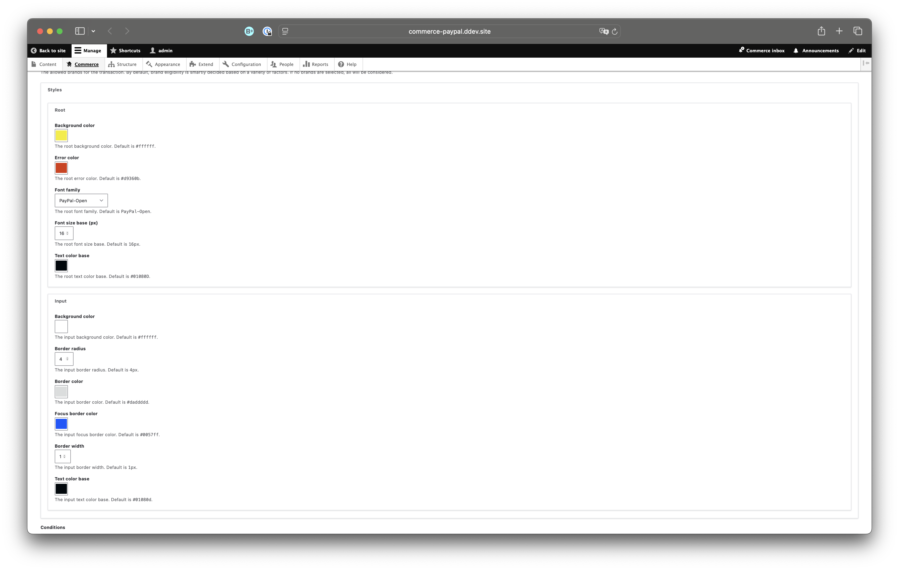
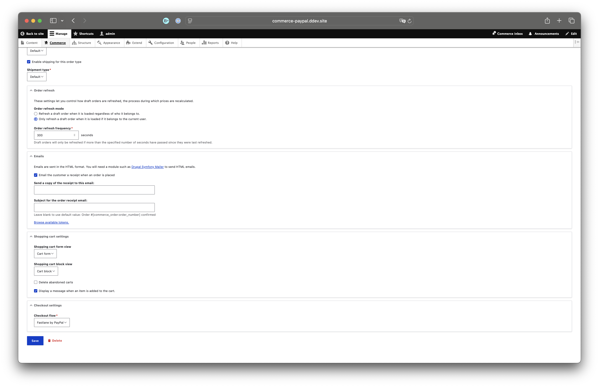

# PayPal Configuration

You need to enable [Fastlane by PayPal](https://www.paypal.com/us/fastlane) on your PayPal account.

!!! info "Fastlane by PayPal is currently only available to US merchants."

1. Sign in to your [PayPal developer account](https://developer.paypal.com/home/)
2. Go to your application
3. Scroll down to "Features"
4. Enable Fastlane.

!!! info "The full Fastlane by PayPal user experience is currently only available to US Customers in the US."
    Non-US customers will be provided a standard credit card component.

    US customers outside the US who are already Fastlane members will have the full experience.

    US customers outside the US who are _not_ Fastlane members will be provided a standard credit card component.

# Fastlane by PayPal configuration

The [Commerce PayPal](https://www.drupal.org/project/commerce_paypal) module now provides the **_Fastlane by PayPal_**
Payment Gateway and Checkout Flow, optimized for guest checkout.

This checkout flow is different from the standard Drupal Commerce Checkout flow. It is a single page checkout flow and
requires several items to be
configured.

## Gateway configuration

To get started, you'll need to configure a new Payment Gateway:

1. Choose a name for this gateway. "Fastlane" works.
2. Choose "Fastlane by PayPal" as the plugin.
3. Choose a display name for this gateway, e.g. "Fastlane by PayPal".
4. Choose "Sandbox" mode when initially setting this up and testing.
5. Specify your API credentials.

1. Specify your webhook ID.
    1. Webhooks ensure if the payment is completed with PayPal, but the customer's browser fails to return to the site (
       e.g. if they lose their network connection, or their device battery dies), the order is still completed. While
       this is not a common occurrence, it can happen.
    2. To obtain your webhook ID, [follow the same steps](../paypal/paypal.md#webhooks-configuration) as for other
       PayPal gateways.
2. Specify the Transaction type
    1. **Capture (recommended)**: Most orders work best with the Capture option.
    2. **Authorize**: If there is a reasonable possibility that orders won't be shipped, you might choose to only
       authorize the transaction initially. You will need to capture the transaction later, either manually or through a
       custom automated process. If you don't capture the payment in time, typically 7 days, then the authorization will
       be canceled and payment will have to be collected again.

1. You may optionally configure the background and input controls of the Fastlane by PayPal component.
    1. Note: if you are not seeing your changes applied, check the browser console for messages from PayPal. If you
       choose color combinations that are not WAI compliant, the PayPal component will **not** apply them.

!!! warning "Only the Fastlane by PayPal Payment Gateway is compatible with the Fastlane by PayPal Checkout Flow."
    You must disable any other Customer facing Payment Gateways. (Unless those Gateways are configured for other Order Types.)

## Checkout Flow Configuration

Fastlane by PayPal implements a single page checkout flow. You'll need to use the **_Fastlane by PayPal_** checkout flow
in tandem with the payment gateway. This checkout flow is created automatically for you, but you'll need to configure
it.

We'll need to configure this checkout flow and ensure certain panes are in a specific position. This is required for the
single page flow to work correctly.

1. On the "Order Information" step:
    1. The Fastlane by PayPal Contact Information pane is required.
        1. It must be the _first_ pane.
    2. The Payment Information pane is required.
        1. It must be the _last_ pane.
    3. Additional panes _may_ be included between these two panes on this step.
        1. The shipping pane, comments pane, and coupon redemption pane have been tested.
        2. Other panes _may_ work, but have not been tested.
2. Additional panes may be included on the "Complete" step, as is typical.

The Checkout flow will validate as much as possible and alert you to invalid pane order and/or pane combinations. Some
panes, like the Contact Information pane, are hidden, as they are not compatible.

## Order Type Configuration

Once your checkout flow is configured, you'll need to configure your order type to use this checkout flow.

## FAQ

### Can I use this for recurring payments/subscriptions?

Vaulted payments are not currently supported by this module, but it is on our roadmap!

### How can I use this with other payment gateways?

This workflow does support other gateways.

If it is important for your site to have multiple customer facing gateways enabled on the same order type, you can use
the PayPal Checkout Gateway with Fastlane. That approach would use the traditional Drupal Commerce multipage checkout
flow, but allows Fastlane in the payment component.
