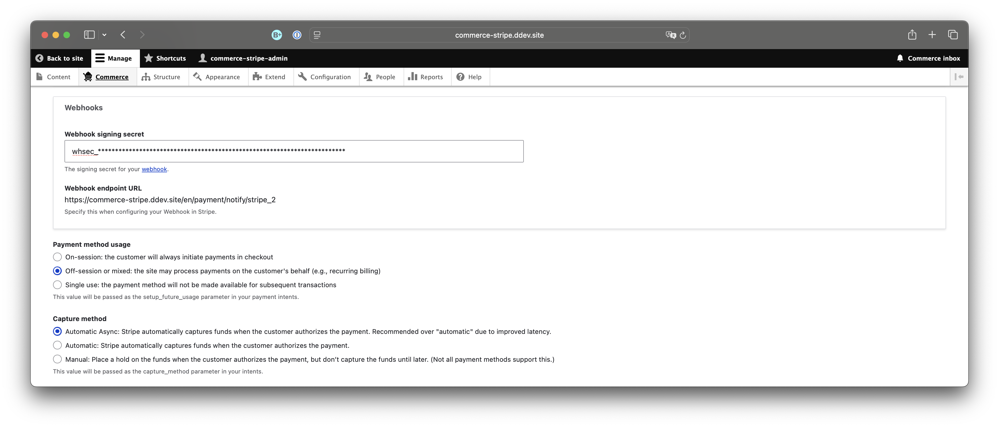
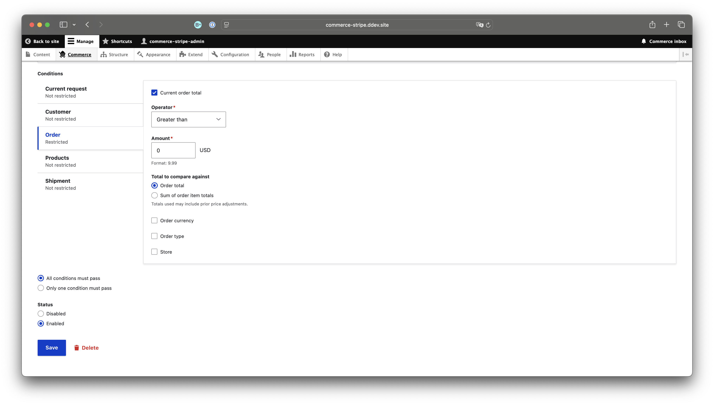

# Stripe configuration

The [Commerce Stripe](https://www.drupal.org/project/commerce_stripe) module provides multiple payment gateway plugins
for integrating different Stripe products.

Their preferred method is Stripe Payment Element, which injects the appropriate payment methods into the checkout flow
automatically. Depending on the cart contents, user device, browser, and location, Stripe will determine what payment
methods are available to the customer and smartly display the appropriate payment options. This user guide is focused on
the Stripe Payment Element integration, as this is the integration that will be continually developed and supported
going forward.

## Payment Gateway configuration

To get started, you'll need to configure a new Payment Gateway:

1. Choose a **name** for this gateway. "Stripe Payment Element" works.
2. Choose "Stripe Payment Element" as the **plugin**.
3. Choose a **display name** for this gateway, e.g. "Stripe Payment Element".
4. Choose "Test" **mode** when initially setting up your gateway.
    1. You'll need to use live in production.
    2. Preferably, you'll have two configurations, and use config_split to manage them, depending on your environment.
5. Collect Billing Information should be enabled in most cases.
6. Choose your authentication method:
    1. Stripe connect. The new, preferred and simpler way.
    2. API credentials. The traditional authentication method.
 
!!! tip "You can now connect to stripe by signing in to your account, rather than storing your credentials."

### Webhooks

Webhooks are highly recommended, and will be required in the future.

In a typical checkout, the customer will complete their payment and Stripe indicates through a browser return request
that the order has been paid.

On occasion, though, a customer may complete the payment, but lose their network connection or the battery dies on their
device, before the payment acknowledgement is completed.

Webhooks ensure that orders are completed, even if the customer's browser does not make the return trip to the site.

Webhooks also allow payments to be automatically updated, when payment cancellations or refunds occur on the Stripe/Bank
side.

For some payment methods, specifically USBankAccounts (ACH), Webhooks are required to ensure payment is received, as
payment is not received for several days, and, in fact, may be unsuccessful.

In order to respond to these events configuration in Stripe is necessary.

### Capture Method

| Capture Method  | Description                                               |
|-----------------|:----------------------------------------------------------|
| Automatic Async | The new Stripe default.                                   |
| Automatic       | The previous default.                                     |
| Manual          | Requires a manual or automated workflow to capture funds. |

Automatic Async is the new Stripe default, and should be used. If you created your payment gateway before Stripe added
this value, your setting will likely be the previous default of Automatic. You should be able to switch, but keep an eye
out any time you are making changes.

Manual capture is available for merchants who have complex inventory and shipping scenarios.

Pros of manual capture:

1. You don't capture your customer's funds until you actually ship the product.
2. You avoid refund fees, if you are unable to ship the product.

Cons of manual capture:

1. You have a limited amount of time to capture the funds. (Typically 7 days, but multiple factors impact this,
   including payment method and country.)
2. You have to manually perform the capture on the order. (Or build an integration with your shipping system to automate
   the capture.)
3. If you fail to capture in time, the payment will be cancelled, and you won't have payment!
4. Not all payment methods support Manual capture.

### Payment Method Usage

| Future Usage | Description                                                                                                                                                                                                                                         |
|--------------|:----------------------------------------------------------------------------------------------------------------------------------------------------------------------------------------------------------------------------------------------------|
| Single Use   | No payment token will be stored. The customer will need to enter their payment information for each order.                                                                                                                                          |
| Off-Session  | A payment method token is stored. This allows for payments to be made without Customer interaction.                                                                                                                                                 |
| On-Session   | A payment method token is stored. The customer won't need to re-enter their information if they are using the same payment method, but would need to interact in a checkout flow, especially if the payment method requires additional interaction. |

For many cases, Single Use will be your best option. This is especially true if you typically have anonymous checkouts
and/or low return buyers. Some payment methods are only supported with this option, e.g. AliPay, Klarna, Affirm.

If you sell recurring subscriptions or memberships, though, you will need to use Off-Session in order to charge
subsequent payments.

If your customers authenticate on your site, and make frequent purchases, On-Session will be most convenient for them.

If you have a mix of all 3, you as the merchant should make the choice that best works for you and your customers.

Another option, if you do have a mix, is to write custom Event Subscribers to dynamically determine the best option for
a particular order.

### Supported Payment Methods

The following payment methods are currently supported:

| Payment Method        | Single Use       | Off-Session      | Off-Session      | Supports Manual Capture |
|-----------------------|------------------|------------------|------------------|-------------------------|
| Card                  | :material-check: | :material-check: | :material-check: |                         |
| Apple Pay             | :material-check: | :material-check: | :material-check: |                         |
| GooglePay             | :material-check: | :material-check: | :material-check: |                         |
| Affirm                | :material-check: | :material-close: | :material-close: |                         |
| AliPay                | :material-check: | :material-close: | :material-close: |                         |
| AmazonPay             | :material-check: | :material-check: | :material-check: |                         |
| CashApp               | :material-check: | :material-close: | :material-close: |                         |
| Klarna                | :material-check: | :material-close: | :material-close: |                         |
| US Bank Account (ACH) | :material-check: | :material-check: | :material-check: | :material-close:        |
| WeChatPay             | :material-check: | :material-close: | :material-close: |                         |

!!! Note "Apple Pay and GooglePay are unique Payment Methods."
    While they are listed as separate Payment Methods on Stripe, they are actually under the "Card" Payment Method Type in the Stripe API implementation.

!!! warning "We do not currently support all Payment Methods that Stripe does."
    Payment Methods not listed above are not currently supported. 

    Do not enable them on your Stripe account. 

    The payment will complete, but the order will not.

## FAQ

### Difference between Payment Element and Card Element?

Card element only supports credit card payments. This does **_not_** include Apple Pay or GooglePay.

Payment Element supports all the Payment Methods listed above, and more that will be added in the future.

You should be using the Payment Element, unless you have a compelling business or technical reason not to.

### Why doesn't the Stripe Payment Element support Payment Method [xyz]?

We are working towards supporting all Payment Methods that Stripe supports!

Because different payment methods have varying support for future usage(recurring payments) and capture methods, among
other features, it is necessary for us to create a plugin for each payment method type.

This takes time and effort. It is complicated when a payment method is only available in a specific geographic region, as that limits testing ability.

### Zero Dollar Orders

We will be adding support for Zero dollar orders that require a payment method. (e.g. A trial subscription that then renews using the provided payment method.) 

This functionality was recently added to commerce core.

If your site currently supports orders that can be $0 (e.g. a coupon applies a 100% discount), you should add a condition to the Stripe Payment Element conditions that orders must be greater than $0.

