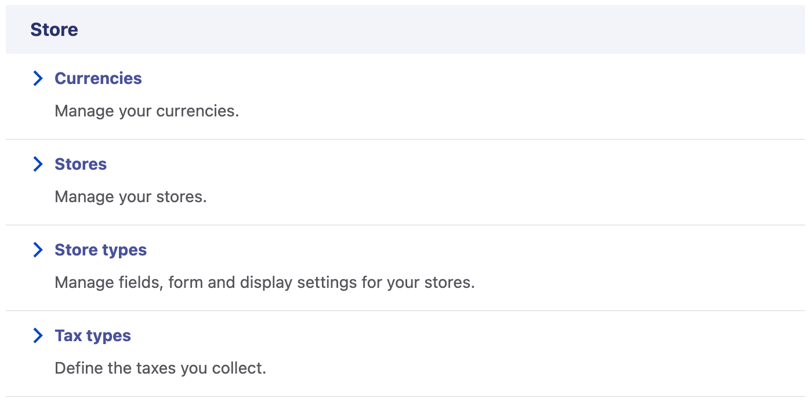
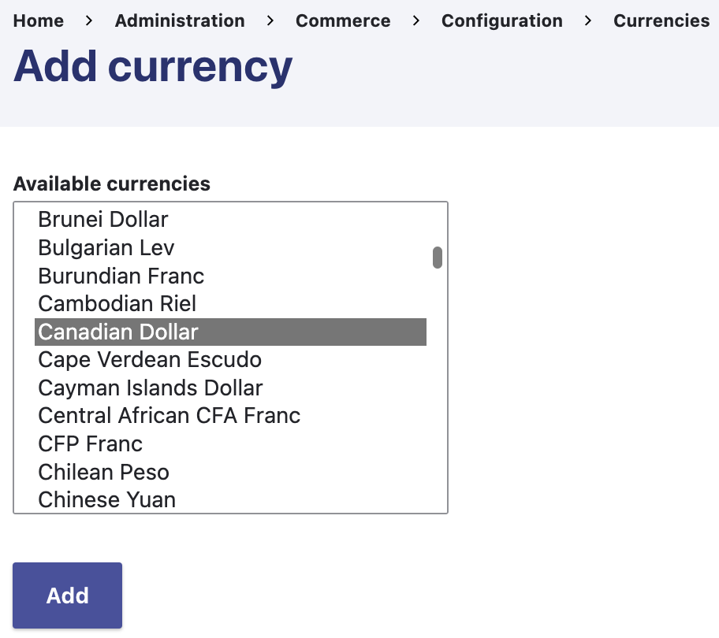
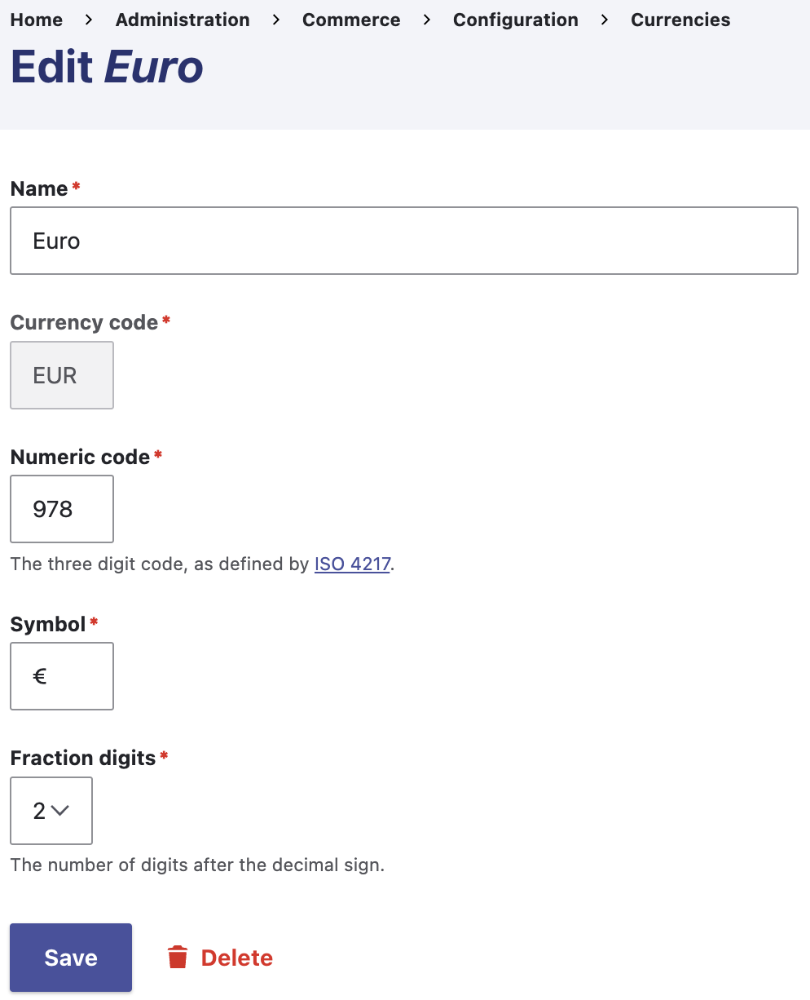

Drupal Commerce sites all have one or more store to which products are published and shopping carts / orders belong. Store objects also contain configuration like the name and email address used in customer communications, the default currency and timezone, the available billing and shipping countries, and more.

There are several use cases for using multiple stores, such as marketplaces or sites supporting multiple brands or retail locations. Regardless of how many stores your site has, there will always be one [default store](#changing-the-default-store) that provides context for site navigation or cart interaction unless the current store is resolved through some other means.

Stores are also used for invoicing, [tax types](./taxes.md), and any other settings necessary for understanding orders. This has many applications, and it's important to understand what use cases are supported out of the box and how that impacts checkout and other [order workflows](./orders.md).

## Adding a currency

Drupal Commerce uses the [CLDR](https://cldr.unicode.org/) dataset to define currencies and format them based on the locale. This is facilitated by the multilingual and localization capabilities of Drupal itself.

Before creating a store, you must add at least one currency. When Commerce is installed, the Drupal site's default country's currency is imported. For example, if the default country was set to "United States", USD would be imported. If the default country was set to Germany, EUR would be imported.

To import an additional currency, navigate to *Commerce > Configuration > Store > Currencies*.

Click the *Add currency* local action link, and the next form will provide you with a list of available currencies to import. Select your currency and click *Add*.

While not common, sometimes you may wish to modify a currency you imported. Click the *Edit* operation button to modify the currency as needed.

## Creating a store

Navigate to *Commerce > Configuration > Store > Stores* and click the *Add store* local action link.

This will take you to a form where you will be prompted to supply all the details mentioned above. Be sure to review both the main form and the items in the sidebar.

Once you’ve got all the details filled out, click save. Then, you can begin creating products.

## Changing the default store

When you have more than one store, the default store is selected as the context for a customer's interactions with your site unless a module instructs Commerce to use a different one. For example, a multi-brand site using a subdomain per brand may use the [Commerce Store Domain](https://www.drupal.org/project/commerce_store_domain) module to change the store context based on the domain used to access the site.

To change the default store, from the *Stores* list click the *Edit* operation button for the store you would like to make the default:

At the bottom of the form, check the box labeled *Make this the default store.* Submit the form, and the default store will be updated:

Note that this means the previously selected default store will be saved at the same time to remove its default status.

## Multi-store scenarios

Supporting multiple stores in Commerce Core allows us to address several use cases:

1. A site with multiple retail locations may use stores for tracking product availability and inventory levels by location.
2. A company with multiple brands may use stores to identify a store based on a brand-specific domain used for each store.
3. A marketplace might permit merchants to create stores on the site to represent their own inventories within the marketplace.

In most cases, the multi-store architecture supports certain requirements but leaves others unfulfilled. You will need to find contributed modules or pay for custom module development to close the gaps. For example, a marketplace may want to give merchants permissions that don't exist with respect to managing their own store listings, inventory, or payments. You would need to engage an agency to help you identify those gaps and address them.
