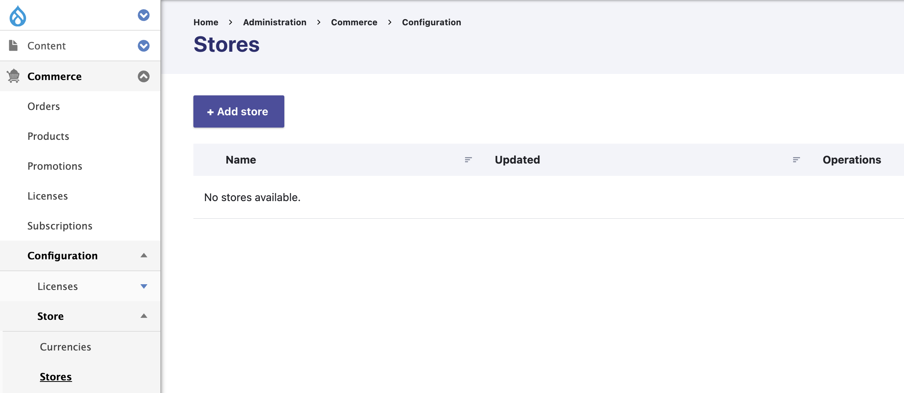
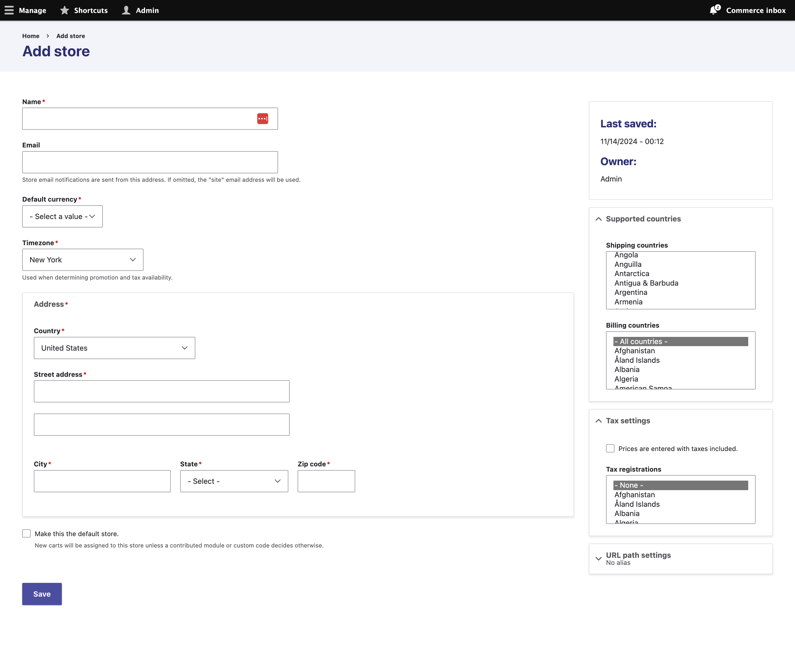
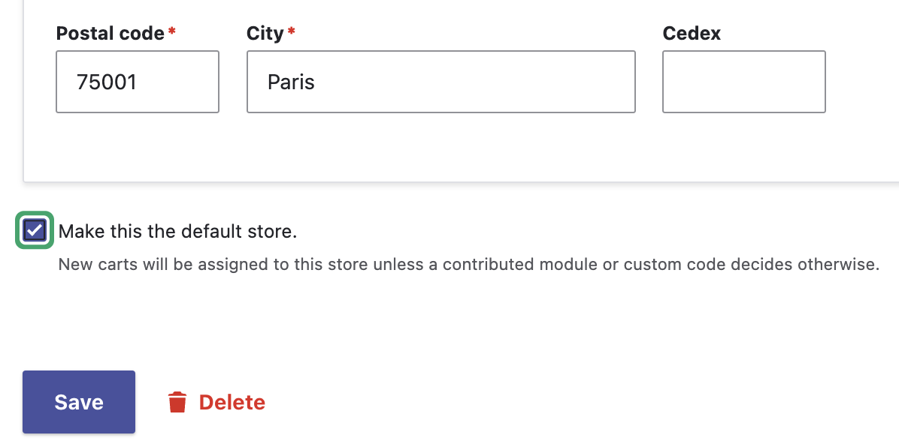

Drupal Commerce sites all have one or more store to which products are published and shopping carts / orders belong. Store objects also contain configuration like the name and email address used in customer communications, the default currency and timezone, the available billing and shipping countries, and more.

There are several use cases for using multiple stores, such as marketplaces or sites supporting multiple brands or retail locations. Regardless of how many stores your site has, there will always be one [default store](#changing-the-default-store) that provides context for site navigation or cart interaction unless the current store is resolved through some other means.

Stores are also used for invoicing, [tax types](./taxes.md), and any other settings necessary for understanding orders. This has many applications, and it's important to understand what use cases are supported out of the box and how that impacts checkout and other [order workflows](./orders.md).

## Stores require a currency

Before you can create a store, you must have at least one currency imported. When Commerce is installed, the Drupal site's default country's currency is imported. For example, if your site's default country was set to United States, USD would be imported. If the default country was set to Germany, EUR would be imported. See [Adding a currency](./currencies.md#adding-a-new-currency) to import additional currencies if needed.

## Create a store

To create a store, navigate to the *Commerce > Configuration > Store > Stores* interface and click the <em>Add store</em> local action link. This will take you to a form where you aill be prompted to supply all of the details mentioned above. Be sure to review both the main form and the items in the sidebar.

Once you’ve got all the details filled out, click save and you can begin creating products.

## Changing the default store

The default store can be thought of as your primary store. When Drupal Commerce determines the current store for a product or order, this will be used if it cannot be determined.

Go to the Stores management page from the Configuration page

Click on **Edit** for the store you would like to make default.

At the bottom of the form, check the **Default** checkout, and then press **Save** to update the store and make it default.

## Use Cases

**! This section should be moved to a subsection, possibly. Detailing how to use multiple stores, or setup a marketplace model.**

We optimize for the two use cases:

1. One business that has one or more locations **or** 2. The marketplace model (where you have sellers)

For these use cases and possibly others, it is up to the developer to
fill in the gaps that are present in the order workflow. This is
different from Commerce 1.x in that we will support stores by default,
allowing for community contributions to extend the functionality instead
of trying to build store functionality from scratch.

#### One or more locations

This is the most common eCommerce situation where we have a single
person, company, or organization that is taking payments online.

#### Marketplace model

The marketplace model is where you have many sellers who are taking
payment for unique products.
